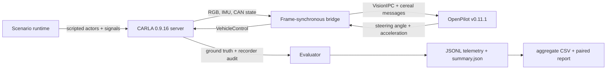

# OpenPilot × CARLA — Urban Driving Simulation

A reproducible, frame-synchronous research harness for evaluating OpenPilot in
CARLA across controlled urban driving scenarios. The project includes a CARLA
adapter for the current OpenPilot simulator interface, deterministic scenario
actors, a privileged CARLA Traffic Manager reference, raw telemetry recording,
run-level metrics, paired statistical analysis, tests, and setup automation.

> OpenPilot is a Level 2 driver-assistance system, not an autonomous urban
> driving system. Pedestrians, traffic lights, stationary obstacles,
> and close cut-ins are explicitly treated here as **boundary tests**, not as
> product-compliance tests. See OpenPilot's official
> [limitations](https://docs.comma.ai/LIMITATIONS/).

## Calibrated vehicle controller

https://github.com/user-attachments/assets/5909a73e-0fed-4d54-ad97-fa0a3ce676ee

Press play above to watch directly on GitHub, or **[download the full-resolution 34-second demo](https://github.com/nazar-110/openpilot-carla-evaluation/raw/refs/heads/master/media/openpilot-carla-demo.mp4)**
— road-camera predicted path, chase camera, and live controller decisions.
This prototype completed its route but **failed driving-quality checks**.
The footage is real, not a synthetic or AI-generated driving demonstration.

The longitudinal adapter uses measured CARLA pedal-response curves with bounded
PI feedback. In an independent dry-road actuator test, acceleration RMSE fell
from **3.651 to 0.779 m/s²** (78.7% lower; 360 samples per controller).
This is not an urban-driving safety result. See the [calibration protocol and
limitations](docs/CALIBRATION.md) and [raw verification data](reports/calibration/validation.json).

The visible launcher supports a real sensor recording with `-RecordDemo`:

```powershell
powershell -NoProfile -ExecutionPolicy Bypass -File .\scripts\run_visible_openpilot.ps1 -RecordDemo
```

Run this from the cloned project directory. Use `-CarlaRoot`, `-Distro`, and
`-OpenPilotRoot` to override machine-specific installation locations. Setup is
documented in [Windows + WSL instructions](docs/SETUP_WINDOWS_WSL.md).

## Current status

- The local pipeline is implemented and verified with 83 automated tests on
  both Windows and the OpenPilot WSL environment.
- The included synthetic smoke suite runs end to end and labels every artifact
  `valid_for_research: false`.
- The recorded calibrated pilot completed its route in 34.45 seconds:
  690 samples, 309.9 m, continuous engagement, no collisions, and RMS jerk
  1.690 m/s³. It had 3 lane invasions and 1.75 seconds off-road, so its
  driving-quality result is **FAIL**. The modified OpenPilot environment also
  means `valid_for_research: false`. [Full trial summary](media/demo-summary.json)
  and [raw telemetry](media/demo-telemetry.jsonl) are included.
- The real adapter targets **CARLA 0.9.16** and **OpenPilot v0.11.1** at commit
  `4df40d2c1946a57242230186edd073c4073060a6`.
- Real CARLA/OpenPilot trials require the external simulator and OpenPilot model
  environment; they are intentionally not represented by generated demo data.

CARLA support was removed from upstream OpenPilot when MetaDrive replaced it in
2023 ([commaai/openpilot#30690](https://github.com/commaai/openpilot/pull/30690)).
This project ports CARLA to OpenPilot v0.11.1's current `World` interface rather
than silently using the obsolete bridge. The older official CARLA bridge remains
useful as provenance and is documented in [Architecture](docs/ARCHITECTURE.md).

## Experiment at a glance

The main configuration expands to **420 controller trials in 210 matched pairs**:

| Factor | Levels |
|---|---|
| Controller | OpenPilot; CARLA Traffic Manager reference |
| Scenario | Lane curves; lead braking; pedestrian crossing; cut-in; red light; parked obstruction; degraded-visibility lane tracking |
| Environmental condition | Clear noon; clear night; rainy daylight with wet traction |
| Repetitions | 10 paired seeds per cell |

The reference controller receives privileged simulator state. It is a
privileged sanity/reference controller, not a sensor-equivalent competitor or a
guaranteed performance upper bound.

Primary outcome:

```text
intervention_free_success =
  route completion >= threshold
  AND no collision
  AND no forbidden lane/road departure
  AND no configured red-light violation
  AND no post-warmup controller disengagement
```

Safety, lane keeping, speed tracking, comfort, compliance, control latency, and
mission completion remain available as separate metrics so the composite cannot
hide a failure mode.

## Architecture



Exactly one process owns `world.tick()`. CARLA and Traffic Manager run in
synchronous mode at 20 Hz with a 50 ms fixed timestep and physics substeps no
larger than 10 ms. Camera samples are joined by CARLA frame ID, handed off with
single-frame backpressure, and mapped to OpenPilot camera frame IDs. IMU samples
retain their exact CARLA frame identity. A stopped server-side CARLA recorder is
the collision authority, while synchronous vehicle geometry is the lane-boundary
authority; asynchronous sensor callbacks supply diagnostics only. These choices
follow CARLA's official
[synchrony and determinism guidance](https://carla.readthedocs.io/en/0.9.16/adv_synchrony_timestep/).

After warmup, both controllers enter a continuous two-tick neutral transition
without teleporting the live vehicle. They receive exactly two neutral CARLA
ticks. For OpenPilot, the final settling camera pair must be linked through
non-conflated `modelV2 -> longitudinalPlan -> controlsState` events to the exact
`carControl` selected by the simulator. CARLA stays paused and control remains
neutral until that lineage is verified; the accepted command is then applied
before the first evaluated physics tick.

## Quick local verification

The smoke backend checks configuration expansion, recording, metric calculation,
and reporting without pretending to run OpenPilot or CARLA.

```powershell
python -m venv .venv
.venv\Scripts\Activate.ps1
python -m pip install -e ".[dev,analysis]"

opencarla-eval validate --experiment experiments/smoke.yaml
opencarla-eval run --experiment experiments/smoke.yaml --backend synthetic
opencarla-eval analyze results/smoke --output reports/generated/smoke
python -m pytest
python -m ruff check .
python -m ruff format --check .
```

The report will prominently state that smoke results are not research-valid.

## Real simulator setup

Recommended host layout on Windows:

- Run the CARLA 0.9.16 server natively on Windows with the NVIDIA GPU.
- Run OpenPilot v0.11.1 and this Python package in Ubuntu 24.04 under WSL2.
- Connect the WSL client to CARLA over CARLA's RPC/streaming ports 2000-2002.

Full instructions are in [Windows + WSL setup](docs/SETUP_WINDOWS_WSL.md).

The condensed sequence inside Ubuntu 24.04 is:

```bash
git clone https://github.com/commaai/openpilot.git ~/openpilot
cd ~/openpilot
git checkout --detach 4df40d2c1946a57242230186edd073c4073060a6
tools/op.sh setup
source .venv/bin/activate
scons -u -j"$(nproc)"
bash "/mnt/c/path/to/this/project/scripts/apply_openpilot_wsl_compat.sh" "$HOME/openpilot"
uv pip install --python "$VIRTUAL_ENV/bin/python" carla==0.9.16
uv pip install --python "$VIRTUAL_ENV/bin/python" -e "/mnt/c/path/to/this/project[analysis]"
```

### Watch OpenPilot drive

On this Windows/WSL installation, open a normal PowerShell terminal in the
project directory and run:

```powershell
.\scripts\run_visible_openpilot.ps1
```

The launcher starts CARLA visibly at Epic quality if it is not already running,
detects the Windows host address reachable from WSL, checks the pinned
discrete-GPU compatibility setup, and runs the known 40-second OpenPilot pilot.
It leaves the CARLA window open afterward. The fixed pilot run ID is recollected
with `--overwrite`, which archives the preceding attempt under that run's
`attempts` directory.

The launcher provides two synchronized operator views. CARLA's spectator follows
the ego vehicle with a smoothed third-person chase camera, while a separate,
read-only browser dashboard opens after the bridge starts. The dashboard shows
downsampled previews of the exact synchronized road and wide RGB buffers handed
to OpenPilot, an OpenPilot-green predicted-path ribbon projected directly onto
the road-camera image, its bird's-eye path and lane/road geometry, lead
detections, longitudinal plan, engagement state, final steering and acceleration
commands, alerts, and model/control timing. Camera labels include both the CARLA
frame and the corresponding OpenPilot frame ID.

OpenPilot receives no destination or map route in this harness. The dashboard
therefore labels the learned predicted trajectory and longitudinal plan rather
than falsely presenting them as navigation-route planning.

The script prints the dashboard URL and selects the first free port from 8765
through 8799. Use `-DashboardPort <port>` to choose the start of that range, or
`-NoDashboardWindow` to suppress automatic browser opening without disabling the
dashboard server. The dashboard stream ends with the trial; CARLA remains open.

The compatibility patch deliberately makes the upstream OpenPilot checkout
dirty. The launcher therefore enables the explicit exploratory override, and
the resulting artifact remains `valid_for_research: false`. Freeze the patch in
a versioned derived checkout and update the provenance policy before collecting
confirmatory research data.

Do not start OpenPilot's manager manually. The evaluator owns
`tools/sim/launch_openpilot.sh`, starts a fresh manager/modeld process group for
each OpenPilot trial, writes that trial's `openpilot_manager.log`, and stops the
group afterward. It rejects a manager already running from the same checkout.
This per-trial restart prevents controller/model state and VisionIPC connections
from leaking between logical runs.

Verify CARLA connectivity and versions:

```bash
export OPENPILOT_ROOT="$HOME/openpilot"
opencarla-eval doctor --openpilot-root "$OPENPILOT_ROOT" --connect
```

Run one reference trial before involving OpenPilot:

```bash
opencarla-eval run \
  --experiment experiments/urban_suite.yaml \
  --backend carla \
  --controller traffic_manager \
  --limit 1
```

Exercise the per-trial lifecycle with two consecutive OpenPilot pilot runs:

```bash
opencarla-eval run \
  --experiment experiments/urban_suite.yaml \
  --backend carla \
  --controller openpilot \
  --limit 2 \
  --keep-going
```

Run this against empty pilot output paths so both trials execute rather than
pass the reuse gate. Confirm that both run directories contain a separate
`openpilot_manager.log`. Exclude these pilot trials before confirmatory
collection.

Run or resume the full paired suite in randomized seed blocks:

```bash
opencarla-eval run \
  --experiment experiments/urban_suite.yaml \
  --backend carla \
  --randomize-order \
  --order-seed 20260714 \
  --keep-going
```

Existing `summary.json` runs are reused only after their run identity, required
raw files, configuration/runtime/software provenance, valid stopped-recorder
audit, and—on OpenPilot runs—manager log match the requested trial. The artifact
must also be complete and must not request an invalid same-seed rerun. A mismatch
or invalid attempt fails closed and requires `--overwrite`; the explicit
overwrite moves the previous files into a numbered `attempts/` archive before
collecting the replacement.

## Outputs

Each run produces four core artifacts. OpenPilot runs also produce a per-trial
`openpilot_manager.log`:

```text
results/urban_suite/<run-id>/
├── metadata.json       # frozen scenario, condition, seed, versions, calibration
├── telemetry.jsonl     # one frame-aligned ego record per 50 ms tick
├── events.jsonl        # handoffs, safety evidence, triggers, failures
├── summary.json        # metrics, criteria, termination, validity marker
└── openpilot_manager.log  # OpenPilot trials only
```

CARLA recorder files are server-side, not copied into the run directory. The
recorder always runs for collision integrity. With
`carla.recording.carla_recorder: false`, a fixed scratch file named
`opencarla_eval_integrity.rec` is overwritten by the next trial. Setting the
option to `true` uses a unique `opencarla_eval_<run-id>.rec` filename for replay
retention in CARLA's server-side default `Saved` directory.

Aggregate the completed runs with:

```bash
opencarla-eval analyze results/urban_suite --output reports/generated/urban_suite
```

The analysis writes `runs.csv`, `aggregate.csv`, `paired_comparisons.csv`,
`environmental_comparisons.csv`, a Markdown report, and a success-rate plot when
Matplotlib is installed. `attempt_history.csv` accounts for overwritten prior
attempts without adding them to outcome denominators. Binary success intervals use Wilson 95% intervals;
matched comparisons use paired risk differences, paired run-level bootstrap intervals,
exact McNemar tests, and Holm-adjusted p-values.

## Repository layout

```text
config/                 CARLA, camera, timing, and actuation calibration
docs/                   methodology, setup, architecture, and checklists
experiments/            factorial experiment definitions
scenarios/              versioned scenario definitions and thresholds
scripts/                host and WSL helper scripts
src/opencarla_eval/     bridge, runtime, metrics, recording, analysis, CLI
tests/                  fast deterministic unit and end-to-end tests
results/                generated raw artifacts (gitignored)
reports/generated/      generated analysis (gitignored)
```

## Important validity limits

- The CARLA actor is a Lincoln physics model while OpenPilot simulates a Honda
  Civic 2022 radarless CAN platform. The steering ratio/sign and tire friction
  are therefore recorded experimental constructs, not real-vehicle validation.
- The current upstream OpenPilot simulator publishes simplified CAN, fake driver
  monitoring, and synthetic GNSS/IMU. Results describe this software-in-the-loop
  configuration only.
- The transition lineage gate proves direct ancestry from the final settling
  camera pair; it does not purge within-trial state. At the pinned commit,
  modeld retains roughly 4.85 seconds of temporal feature history, and
  planner/control state from the warmup can also survive the two-tick transition.
  Restarting manager/modeld per trial prevents cross-trial carryover, not this
  pre-evaluation warmup context.
- CARLA weather changes camera appearance but does not change tire physics. This
  project separately scales ego, scripted-vehicle, and background-vehicle wheel
  friction for the rainy condition; see CARLA's
  [WeatherParameters API](https://carla.readthedocs.io/en/0.9.16/python_api/#carlaweatherparameters).
- Traffic Manager uses privileged state and has non-human default behavior. Its
  output must not be described as a fair perception-stack comparison.
- Camera FOV, mount, gamma, postprocessing, resolution, timing, steering mapping,
  and software commits must stay frozen after the pilot phase.
- The stopped server recorder is authoritative for collision occurrence. The
  asynchronous collision sensor supplies peak impulse when its callback arrives;
  the evaluator deduplicates repeated contacts with the same actor within 0.5
  seconds.

See [Methodology](docs/METHODOLOGY.md) and the
[Reproducibility checklist](docs/REPRODUCIBILITY_CHECKLIST.md) before collecting
results.

## Upstream references

- [CARLA 0.9.16 release](https://github.com/carla-simulator/carla/releases/tag/0.9.16)
- [CARLA Python API](https://carla.readthedocs.io/en/0.9.16/python_api/)
- [CARLA Traffic Manager](https://carla.readthedocs.io/en/0.9.16/adv_traffic_manager/)
- [OpenPilot repository](https://github.com/commaai/openpilot)
- [OpenPilot simulator documentation](https://github.com/commaai/openpilot/tree/v0.11.1/tools/sim)
- [OpenPilot limitations](https://docs.comma.ai/LIMITATIONS/)

## License

MIT. OpenPilot and CARLA retain their respective upstream licenses.
