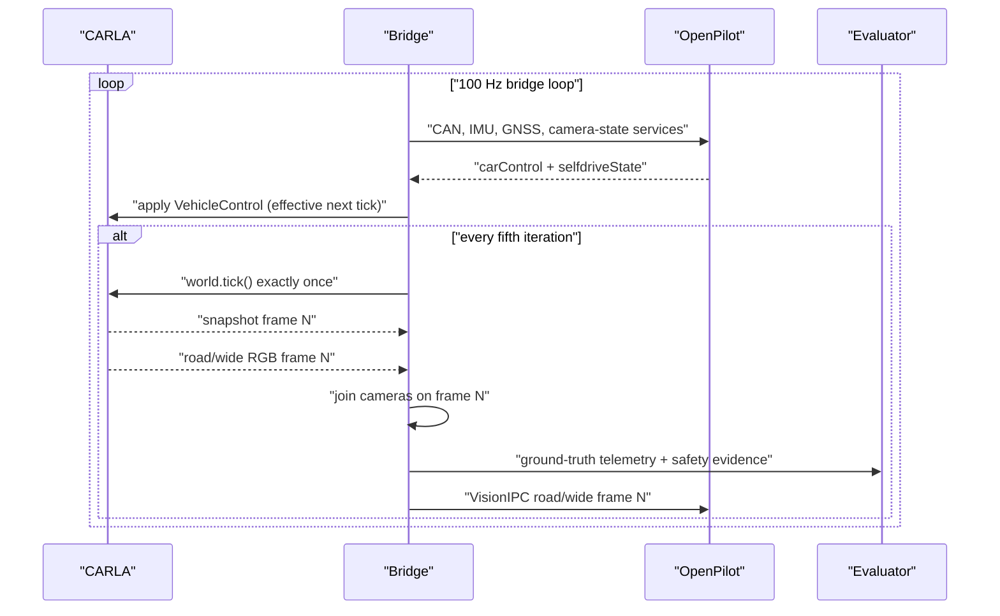

# Architecture

## Design goals

The harness is designed around five requirements:

1. One clock owner, frame-joined road/wide cameras, and frame-tagged events.
2. Repeatable scenario, Traffic Manager, Python, and camera-noise seeds.
3. A strict separation between controller inputs and evaluator ground truth.
4. Raw artifacts sufficient to recompute every reported metric.
5. Explicit invalid-trial handling instead of silently deleting failed runs.

## Version decision

Upstream OpenPilot removed CARLA in
[PR #30690](https://github.com/commaai/openpilot/pull/30690). The final official
CARLA-containing commit was
[`35c0b199`](https://github.com/commaai/openpilot/tree/35c0b199a5ef49acc4728992ab67a153f67edf69/tools/sim),
which targeted Ubuntu 20.04, Python 3.11, and CARLA 0.9.14.

This repository instead targets OpenPilot v0.11.1 on Ubuntu 24.04/Python 3.12
and ports the historical CARLA idea to the current simulator contracts:

- `SimulatorBridge.spawn_world(queue)`
- `World.apply_controls(...)`
- `World.read_state()`
- `World.read_sensors(simulator_state)`
- `World.tick()`
- `World.read_cameras()`
- `World.close(reason)`
- `World.exit_event` and the camera semaphore

The bridge refuses an untested or dirty OpenPilot checkout by default. An
exploratory run may set `OPENCARLA_ALLOW_UNTESTED_OPENPILOT=1`; the resulting
artifact is automatically marked non-research-valid and records the actual SHA
and dirty state.

The evaluator, not the operator, owns the OpenPilot manager lifecycle. It starts
`tools/sim/launch_openpilot.sh` in a new process group for each OpenPilot trial,
records stdout/stderr in `openpilot_manager.log`, and terminates the group after
the bridge exits. A manager already running from the same checkout is rejected.
This makes modeld/controlsd state trial-local and avoids reusing modeld's
one-connection VisionIPC client when the next bridge creates a new camera server.

## Closed-loop sequence

OpenPilot's simulator loop runs at 100 Hz. CARLA advances every fifth loop, so
the physics and camera rate is 20 Hz.



No ScenarioRunner process or second client is allowed to tick the synchronous
world. This avoids the multiple-clock inconsistency documented by CARLA.

## Controller boundary

CARLA to OpenPilot uses the current OpenPilot simulator components:

- road camera: 1928 x 1208, RGB converted to NV12, 40 degree horizontal FOV;
- wide road camera: 1928 x 1208, 120 degree horizontal FOV;
- simulated Honda Civic 2022 radarless CAN and panda state;
- IMU, synthetic GNSS, fake driver monitoring, and peripheral state;
- camera frames through VisionIPC plus `roadCameraState` and
  `wideRoadCameraState`.

OpenPilot to CARLA uses:

```text
throttle = clip(carControl.actuators.accel / 1.6, 0, 1)
brake    = clip(-carControl.actuators.accel / 4.0, 0, 1)
steer    = steer_sign * steeringAngleDeg
           / (max_wheel_angle_deg * steering_ratio)
```

The acceleration scaling is inherited from OpenPilot's current simulator
bridge. Steering sign, steering ratio, and CARLA's reported maximum wheel angle
are stored in every run so the actuation mapping is auditable. Feedback applies
the inverse steering-sign transform before publishing simulated CAN.

`GPSState.from_xy` treats CARLA +x as north and +y as east. The adapter applies
the inverse of OpenPilot's simulator `[-y, x, z]` NED conversion so position,
velocity, and bearing use one convention.

The pinned cruise helper initializes at 40 km/h. All included scenarios use that
target, and configuration validation rejects other ego setpoints until explicit
cruise-button set-speed control is implemented.

## Ground-truth boundary

The evaluator reads CARLA ground truth directly, but none of the following is
published to OpenPilot:

- other-actor transforms or labels;
- lane-center error;
- collision-recorder, collision-sensor, and lane-geometry event data;
- time-to-collision calculations;
- traffic-light stop-line crossing state;
- route completion or pass/fail criteria.

Traffic Manager receives privileged state because it is intentionally a
reference controller, not a fair perception comparison.

## Scenario runtime

`CarlaScenarioRuntime` selects a seed-dependent spawn compatible with the
scenario topology. Lane-following spawns additionally require 160 m before the
first junction, and their pre-evaluation bootstrap is capped at 5 m/s followed
by one second of continuously active control. Other scenario families keep their
declared warmup. Both controllers then receive exactly two neutral-control CARLA
ticks without teleporting or changing the continuous body kinematics. Traffic
Manager is temporarily disabled in that window. The second neutral tick's
road/wide camera pair becomes the OpenPilot causal target. After that pair is
handed off, the bridge pauses CARLA and continues applying neutral commands until
the exact controller command selected by the simulator is proven to descend
from that pair. The verified command is applied before the first evaluated
physics tick. The continuous pose may become the route and hazard origin only
when it is on a non-junction driving lane, within 0.75 m of lane center, and
within 10 degrees of lane heading; otherwise the start is explicitly rejected.
Required actor spawn failure invalidates the trial. A failure to engage within
20 simulated seconds is retained as a controller failure.

The pinned OpenPilot bridge advances 20 empty stabilization ticks before its
main loop; the Traffic Manager runner mirrors those 20 ticks before enabling
autopilot so both paired worlds have the same pre-warmup simulation age.

Scripted behaviors include:

- hard braking followed by a fixed dwell and resume;
- pedestrian traversal orthogonal to the ego lane;
- forced Traffic Manager lane change for a cut-in;
- repeatedly commanded red traffic-signal group with stop-line crossing detection;
- a hand-braked vehicle offset partly into the travel lane.

Scenario realization values are captured from CARLA ground truth rather than
assuming commanded values were achieved.

OpenPilot command messages and human-readable status messages use separate
multiprocessing queues. This is required because the pinned bridge expects every
item on its command queue to have OpenPilot's `QueueMessage` shape.

## Post-reset causal control gate

The gate subscribes with non-conflated sockets to `modelV2`,
`longitudinalPlan`, `controlsState`, `carControl`, and
`lateralManeuverPlan`. It drains and copies every available event, keys the
records by the cereal Event envelope's `logMonoTime`, and fails closed on a
duplicate timestamp, capture-bound overrun, missing required event, or a
capture gap in the alternating `controlsState`/`carControl` prefix. The causal
timestamps must also be strictly ordered
`modelV2 < longitudinalPlan < controlsState < selected carControl`.

For the exact `carControl` timestamp selected by the upstream
`SimulatedCar.sm` immediately before `World.apply_controls`, release requires
this complete chain:

```text
final neutral-settling camera pair F
  -> modelV2 M, with frameId == frameIdExtra == F
  -> longitudinalPlan P, with P.modelMonoTime == M.logMonoTime
  -> controlsState S, with
       S.lateralPlanMonoTime == M.logMonoTime
       S.longitudinalPlanMonoTime == P.logMonoTime
  -> selected carControl C, immediately following S in controlsd publication order
```

`M`, `P`, `S`, and `C` must all be captured and valid. `C` must be enabled
with lateral and longitudinal control active, and the curvature and longitudinal
control-state values in `S` and `C` must agree. The evaluator also requires
`LateralManeuverMode`, `LongitudinalManeuverMode`, and `JoystickDebugMode` to
be false and rejects a valid `lateralManeuverPlan` that would bypass direct
model curvature. The cross-service identity is `Event.logMonoTime`; the
simulator camera timestamp is a different clock domain and is never compared to
it. The accepted lineage and selected command timestamp are copied into
`summary.json`.

This gate certifies direct ancestry, not a flushed temporal state. At the pinned
commit, modeld retains roughly 4.85 seconds of temporal feature history, and
planner/control state from the same trial's warmup may survive the reset. The
fresh manager/modeld process prevents **cross-trial** carryover; it does not
remove this within-trial history.

## Sensor synchronization

CARLA RGB data is BGRA. The adapter converts to contiguous RGB and stores frames
by `SensorData.frame`. `read_cameras()` waits for road and wide images matching
the current world frame. A single-slot producer/consumer handshake prevents the
shared road/wide buffers from being overwritten until OpenPilot's previous
RGB-to-YUV conversion has finished. Each handoff records the CARLA frame and the
corresponding OpenPilot `frameId`; evaluated stale frames are counted as drops,
while intentional startup discards are reported separately. A five-second
wall-clock wait becomes a camera-timeout invalid/system artifact rather than
mixing or duplicating frames.

The continuous IMU stream is awaited by exact CARLA frame before each world tick
is accepted. Sparse collision and lane-invasion callbacks enter a frame-keyed
queue rather than writing metrics asynchronously, but they are supplemental:
CARLA sensor unsubscription is not a callback-completion barrier.

Every trial therefore runs a CARLA **server recorder** from actor setup through
the terminal tick. Cleanup stops the recorder first and queries its completed
frame/collision log. The audit requires the recorder frame count to match the
client's world-frame map and adds any ego collision omitted by the asynchronous
sensor stream before metrics are finalized. A recorder stop, parse, or mapping
failure invalidates the run. Collision callbacks retain actor type and impulse
when available, but recorder occurrence is authoritative.

Lane-boundary occurrence is computed synchronously on each evaluated snapshot
from the ego bounding-box vertices, current driving-lane width, and present left
or right marking. The asynchronous lane-invasion sensor is diagnostic and uses
the distinct `lane_invasion_sensor` event name, so it cannot double-count the
authoritative `lane_invasion` metric. Junctions and snapshots without a valid
driving-lane waypoint do not produce geometric marking-crossing events.

## Operator visualization

The optional visualization layer is outside the control and clock-ownership
boundaries. After each authoritative `world.tick()`, the bridge moves CARLA's
server-owned spectator to a smoothed pose behind the ego vehicle. A spectator
failure is nonfatal, disables further updates, and records one
`spectator_disabled` event.

For OpenPilot trials, an optional loopback-only HTTP dashboard publishes
latest-value diagnostic state and downsampled JPEG previews. The main bridge
only hands immutable frame views to a bounded latest-frame queue; JPEG encoding
and HTTP requests run in daemon threads. Dashboard exceptions disable the view
and record `dashboard_disabled` without ending the evaluation. The dashboard
has no mutation/control endpoint and never calls `world.tick()`.

The path display is OpenPilot's learned `modelV2` trajectory plus lane and road
geometry, alongside `longitudinalPlan` and final control messages. The same
trajectory is projected into the road camera with live calibration, OpenPilot's
0.9 m half-width, camera intrinsics, frame-alignment checks, and its green
on-road gradient. It is not a map/navigation route: this simulator configuration
does not feed OpenPilot a destination. Spectator and dashboard settings are
included in runtime configuration provenance.

## Result lifecycle

Each run directory creates four core files:

- `metadata.json` is written before evaluation starts;
- `telemetry.jsonl` is line-buffered on each evaluated frame;
- `events.jsonl` is line-buffered from callbacks and scenario triggers;
- `summary.json` is atomically replaced after metric computation.

OpenPilot runs add `openpilot_manager.log` for the evaluator-owned per-trial
manager. CARLA recorder files remain in CARLA's server-side default `Saved`
directory.
The recorder always runs: `carla_recorder: false` uses the fixed scratch name
`opencarla_eval_integrity.rec` and the next trial overwrites it, while `true`
uses `opencarla_eval_<run-id>.rec` for server-side replay retention.

If CARLA, actor setup, or the bridge fails before producing telemetry, the
parent writes an invalid-trial summary with `rerun_same_seed: true`. A genuine
OpenPilot disengagement or timeout after valid startup is a system outcome and
remains in the analysis.

Before reusing an existing summary, the runner compares its logical identity,
scenario/condition/experiment hashes, effective runtime configuration, and
recorded software Git state to the requested run. It also requires all three raw
files, complete boolean metrics, a valid stopped-recorder audit, and, for
OpenPilot, `openpilot_manager.log`. A mismatch is rejected and requires an
explicit `--overwrite`. A full-provenance artifact that is marked invalid or
requests a same-seed rerun is also never treated as completed. The explicit
overwrite moves the previous logical run into
`attempts/attempt_NNN/` and renames its summary so recursive analysis cannot
double-count it. Summaries carry scenario/runtime SHA-256 fingerprints and
software commit metadata; differing fingerprints are never pooled silently.

## Cleanup contract

Cleanup is idempotent and proceeds in this order:

1. set the exit signal and close the camera handoff;
2. stop the CARLA server recorder, freezing its terminal collision log;
3. stop all sensor subscriptions and drain callbacks already received;
4. audit recorder frames/collisions and measure scenario realization;
5. finalize JSONL files and atomically write the summary;
6. close causal sockets and destroy sensors;
7. reset controlled traffic lights and destroy scenario/background actors and ego;
8. disable synchronous Traffic Manager and restore asynchronous variable-timestep mode;
9. stop the per-trial OpenPilot manager process group and close its log.

The camera handoff unblocks both sides during teardown so OpenPilot's publisher
thread cannot keep the child process alive while waiting on a final image.
